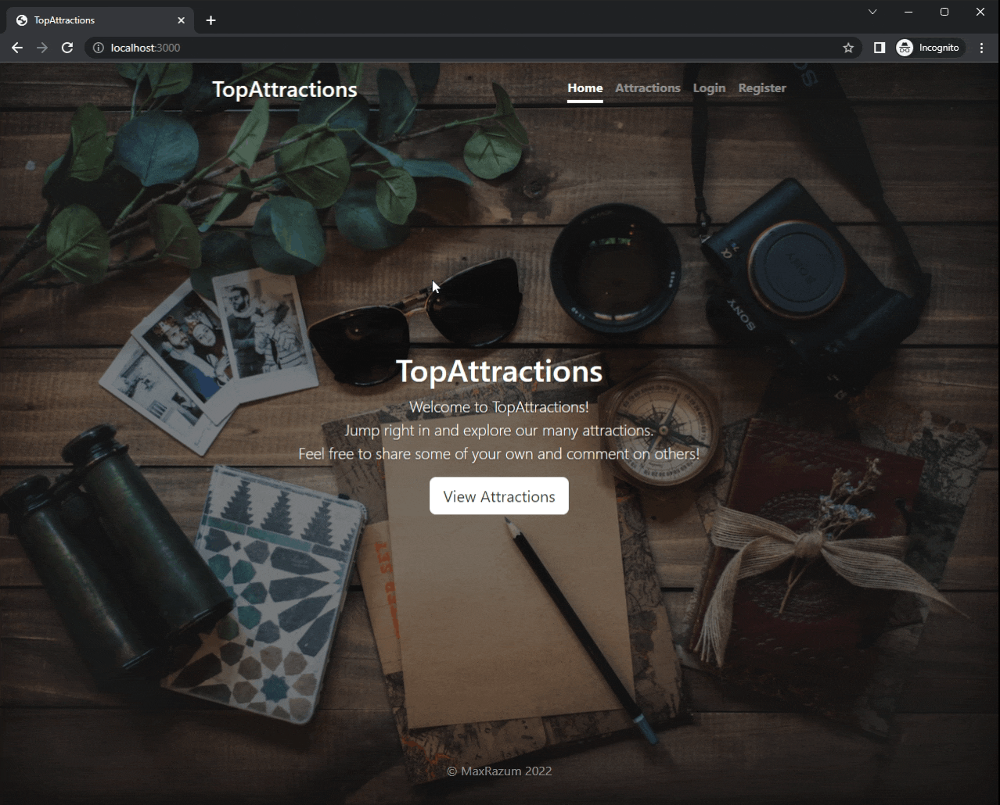
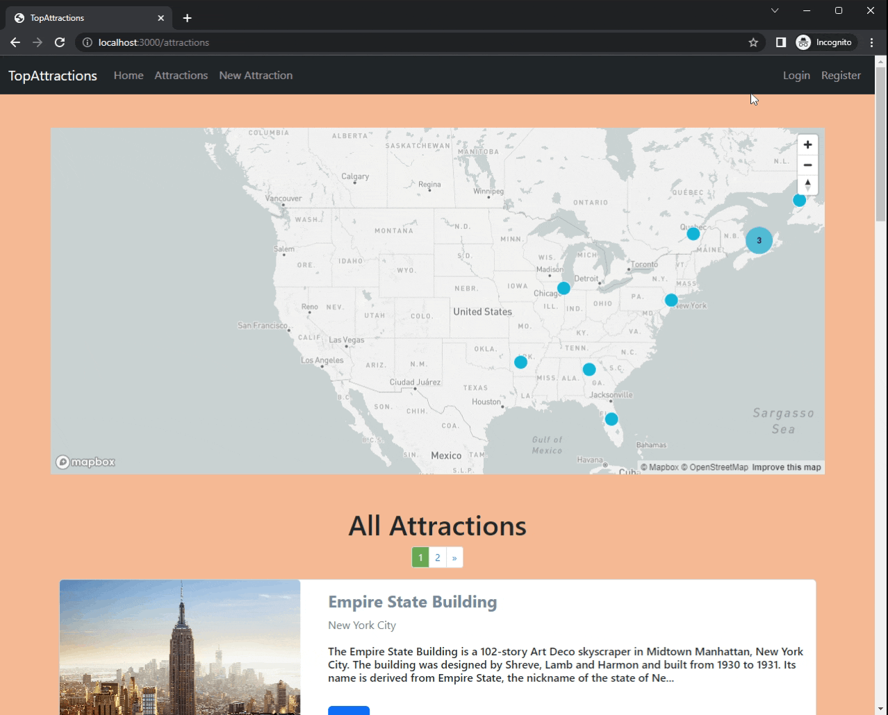
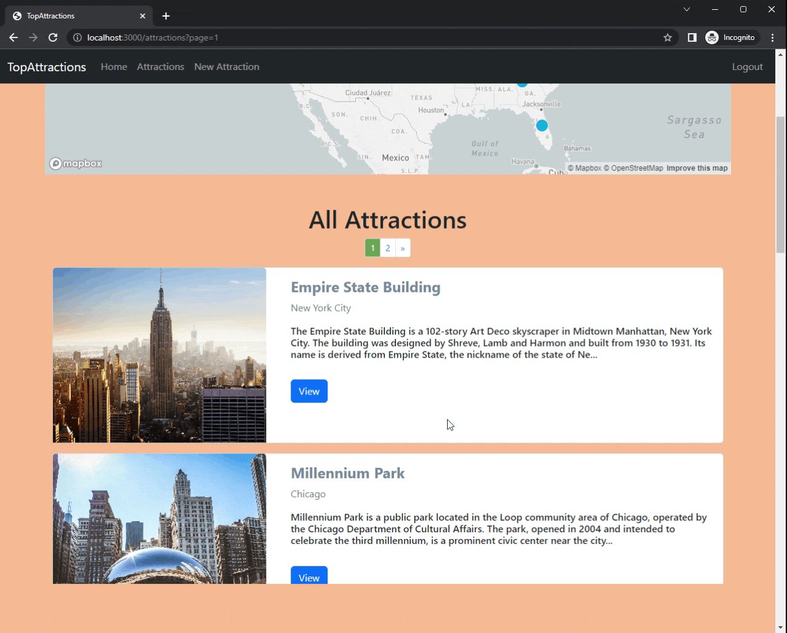
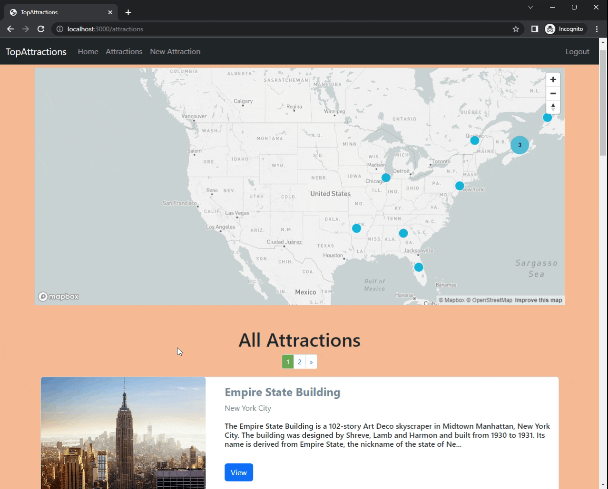
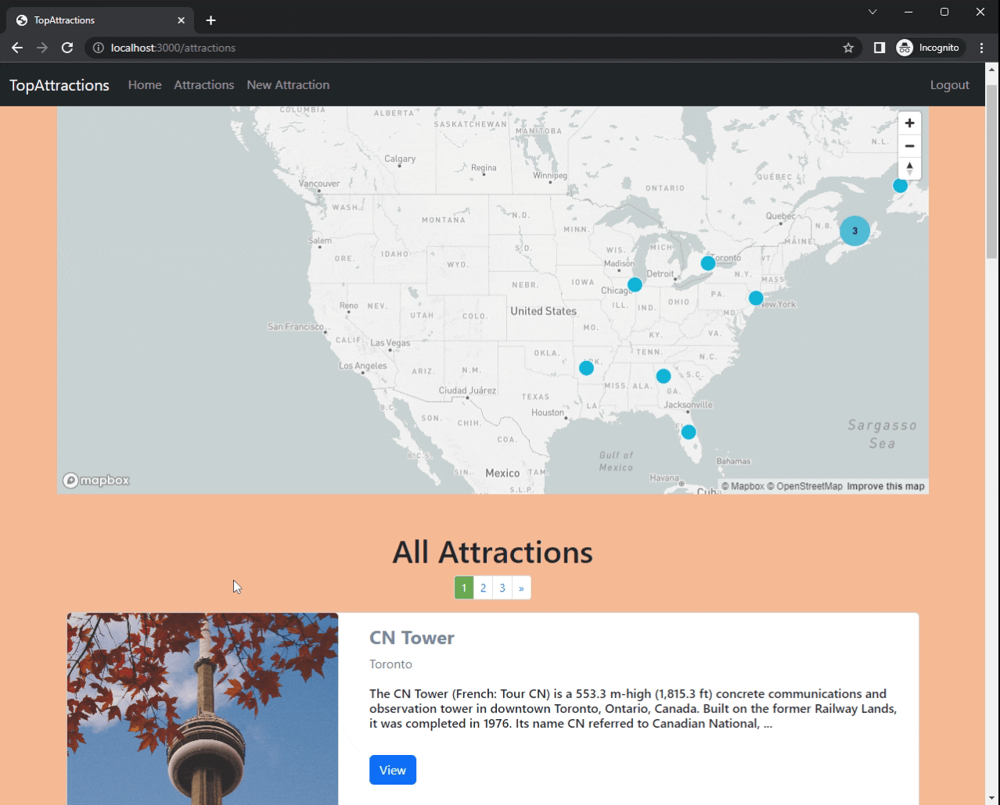
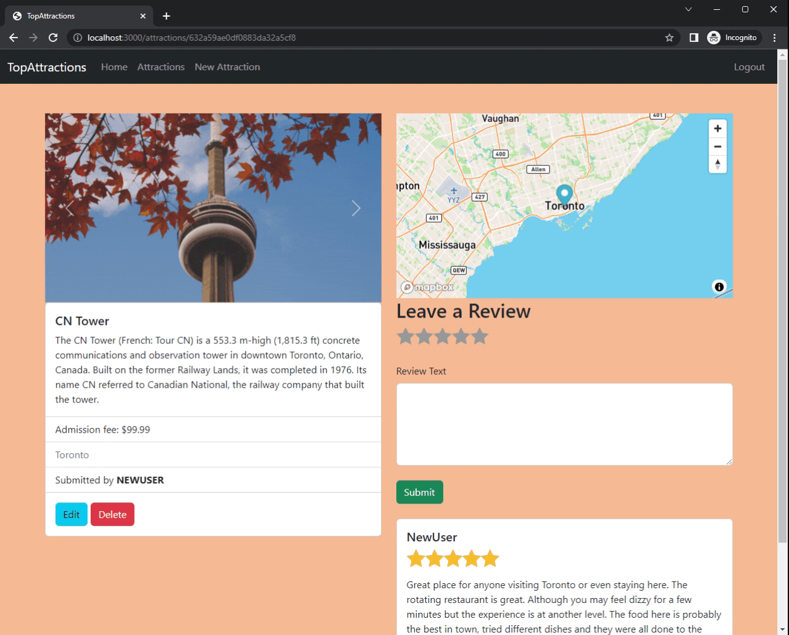

# TopAttractions
This is the full stack CRUD project that allows users to view, post, edit, delete, and leave reviews on the attractions.

## LANGUAGES
    - Javascript
    - HTML
    - CSS

### Built with

- [Node.js](https://nodejs.org/en/) - Node.js® is a JavaScript runtime built on Chrome's V8 JavaScript engine.
- [Express.js](https://expressjs.com/) - Fast, unopinionated, minimalist web framework for Node.js.
- [MongoDB](https://www.mongodb.com/de-de) - The most advanced cloud database service.
- [Mongoose](https://mongoosejs.com/) - Elegant mongodb object modeling for node.js.
- [Heroku](https://www.heroku.com/) - Build and deploy data-driven apps with fully managed data services.

#### Other Tools

- [Bootstrap](https://getbootstrap.com/) - The world’s most popular framework for building responsive, mobile-first sites.
- [Passport](http://www.passportjs.org/) - Passport is authentication middleware for Node.js.
- [Mapbox](https://www.mapbox.com/) - Precise location data and powerful developer tools to change the way we navigate the world.
- [Cloudinary](https://cloudinary.com/) - Transform images and videos to load faster with no visual degradation.

#### Design:

- [Starability.cs](https://github.com/LunarLogic/starability) - Accessible rating with animations on top.

## Previews
#### Register


#### Login


#### All Attractions


#### Show Attraction


#### Create Review


#### Delete Review


#### Create Attraction


#### Edit Attraction


#### Delete Attraction


#### Logout


## To run on your local machine:
### Prerequisties:
1. You should have the following installed on your machine:
- Node
- Mongo
- Git
- VS Code
2. You should have the following accounts to gain access to keys, and tokens required for the project:
- Cloudinary
- Mapbox

### Steps:
1. On the main repository, click the green Code button and copy the SSH.

2. Go or create a directory where you want the repository to be included then type this script on your terminal:
```
git clone [SSH HERE]
```
3. Open the cloned repository on VS Code.
4. On your terminal, download all the dependencies by typing
   `npm i` or `npm install`
5. Create a .env file to store the required keys for the project

    *replace value with the appropriate keys from the required accounts mentioned in the prerequisites*
 ```
CLOUDINARY_CLOUD_NAME=[value]
CLOUDINARY_KEY=[value]
CLOUDINARY_SECRET=[value]
MAPBOX_TOKEN=[value]
```

6. Open a new terminal and type `mongod` to connect the projects on your local database. The project will not start until this is not opened
7. Now to seeds your database, on the previous terminal, type
 ```
 node seeds/index.js
```
8. _(!! Photos of Attractions won't be available !! you'll have to upload them manually)._
9. Hit **CTRL+C** to exit the current process.
10. Now, you are ready to run the program by typing either of the script on your terminal:
```
node app.js
```
  or _(recommended)_
```
nodemon app.js
```
<br>
11. Once you see "Database connected", go to your preferred browser, then go to *localhost:3000*